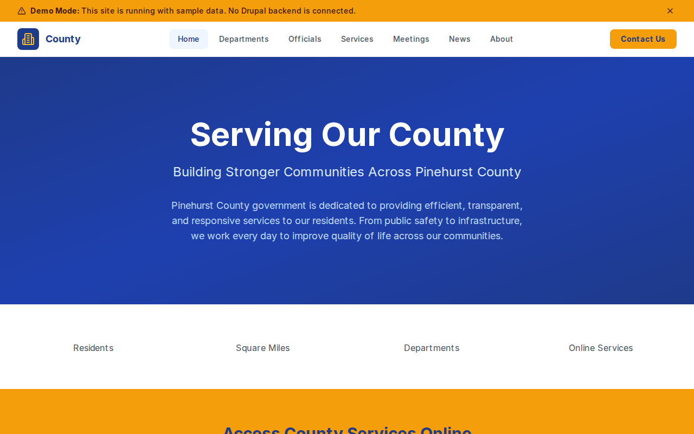

# Decoupled County

A county government website starter template for Decoupled Drupal + Next.js. Built for county governments, regional authorities, and local government agencies.



## Features

- **Departments** - County government departments with contact info, hours, and services
- **County Officials** - Elected and appointed officials with profiles and responsibilities
- **County Services** - Resident services with eligibility, fees, and online access links
- **Public Meetings** - Board meetings, hearings, and public sessions with agendas
- **News & Press Releases** - County announcements, infrastructure updates, and community news
- **Modern Design** - Clean, accessible UI optimized for government content

## Quick Start

### 1. Clone the template

```bash
npx degit nextagencyio/decoupled-county my-county
cd my-county
npm install
```

### 2. Run interactive setup

```bash
npm run setup
```

This interactive script will:
- Authenticate with Decoupled.io (opens browser)
- Create a new Drupal space
- Wait for provisioning (~90 seconds)
- Configure your `.env.local` file
- Import sample content

### 3. Start development

```bash
npm run dev
```

Visit [http://localhost:3000](http://localhost:3000)

---

## Manual Setup

<details>
<summary>Click to expand manual setup steps</summary>

### Authenticate with Decoupled.io

```bash
npx decoupled-cli@latest auth login
```

### Create a Drupal space

```bash
npx decoupled-cli@latest spaces create "My County"
```

Note the space ID returned. Wait ~90 seconds for provisioning.

### Configure environment

```bash
npx decoupled-cli@latest spaces env 1234 --write .env.local
```

### Import content

```bash
npm run setup-content
```

This imports:
- Homepage with hero, statistics, and CTAs
- 3 Departments (Public Works, Health & Human Services, Planning & Zoning)
- 3 County Officials (Chair, Administrator, Sheriff)
- 3 County Services (property tax, building permits, voter registration)
- 3 Public Meetings (board meeting, planning commission, budget workshop)
- 3 News Articles (broadband, emergency preparedness, park renovation)
- 2 Static Pages (About, Contact)

</details>

## Content Types

### Department
- **title**: Department name
- **body**: Department description and responsibilities
- **phone**: Contact phone
- **email**: Contact email
- **location**: Office address
- **hours**: Office hours
- **department_category**: Department classification
- **image**: Department image

### County Official
- **title**: Official name
- **body**: Biography and priorities
- **position**: Title/role
- **department**: Associated department
- **email**: Official email
- **phone**: Contact phone
- **office**: Office location
- **photo**: Official portrait

### County Service
- **title**: Service name
- **body**: Service description and process
- **department**: Responsible department
- **online_url**: Online service URL
- **eligibility**: Who can use the service
- **fee**: Associated costs
- **service_category**: Service classification
- **image**: Service image

### Public Meeting
- **title**: Meeting name
- **body**: Agenda and details
- **meeting_date**: Start date/time
- **end_date**: End date/time
- **location**: Meeting venue
- **meeting_type**: Type of meeting
- **agenda_url**: Link to agenda document
- **image**: Meeting image

### News Article
- **title**: Headline
- **body**: Article content
- **image**: Featured image
- **category**: News category
- **featured**: Featured flag

## Customization

### Colors & Branding
Edit `tailwind.config.js` to customize colors, fonts, and spacing.

### Content Structure
Modify `data/county-content.json` to add or change content types and sample content.

### Components
React components are in `app/components/`. Update them to match your design needs.

## Demo Mode

Demo mode allows you to showcase the application without connecting to a Drupal backend.

### Enable Demo Mode

```bash
NEXT_PUBLIC_DEMO_MODE=true
```

### Removing Demo Mode

1. Delete `lib/demo-mode.ts`
2. Delete `data/mock/` directory
3. Delete `app/components/DemoModeBanner.tsx`
4. Remove `DemoModeBanner` from `app/layout.tsx`
5. Remove demo mode checks from `app/api/graphql/route.ts`

## Deployment

### Vercel (Recommended)
[](https://vercel.com/new/clone?repository-url=https://github.com/nextagencyio/decoupled-county)

### Other Platforms
Works with any Node.js hosting platform that supports Next.js.

## Documentation

- [Decoupled.io Docs](https://www.decoupled.io/docs)
- [Next.js Documentation](https://nextjs.org/docs)
- [Drupal GraphQL](https://www.decoupled.io/docs/graphql)

## License

MIT
